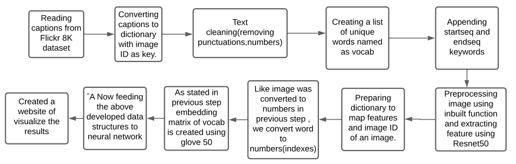

# Image Captioning Project

 

## Difficulties faced in this project

1 Huge vocab size (8424)  -> Reducing vocab size -> Thresholding : 1652+2 
2 How to identify start and end of the sentence -> added startseq token and endseq token to the vocabulary  
3 Training the model -> Model is trained using partial captions  
4

## Reasons for using Recurrent neural network(RNN):

Artificial Neural Network (ANN) are stateless i.e. they do not remember the previous output.

For caption prediction for an image we need a neuron which can remember the previous output i.e. sentence predicted till now.

Hence here RNN comes into play as in RNN previous output can be fed again as the new input.

## Reasons for using Convolutional neural network(CNN):

Images consist of high dimension data(features), some of which may not be useful for training the model.

There Is a need to extract relevant features from images so as to reduce training time and improve accuracy.

Hence, CNN comes into play as it can be used for feature extraction from the images.

## Introduction

Image caption generation is a complicated task.

The main challenge in this problem is to predict captions efficiently for a previously unseen image.

Also, there can be multiple correct captions for the same image.

Building deep learning based image caption generator involves deploying deep neural networks along with image processing techniques.

## Motivation
Help the Visually Impaired,
Self Driving Cars,
Skin Cancer Prediction,
Classifying images in our Phone
 
## Dataset used - Flickr8k dataset
 
A new benchmark collection for sentence-based image description and search

Consisting of 8,000 images that are each paired with five different captions 

Which provide clear descriptions of the salient entities and events. The images were chosen from six different Flickr groups, and tend not to contain any well-known people or locations, but were manually selected to depict a variety of scenes and situations

### Reason for choosing this dataset

Training neural network requires huge amount of data. This dataset contains 8k images and each image contain 5 captions. Total 8k * 5 = 40K sentences. So,this much amount of data can be used for training neural network.

For a image there can be more than one captions. So this dataset also fulfill this aspect.

## Convolutional Neural Network

Advantages:

Very High accuracy in image recognition problems. Compared to its predecessor.
Automatically detects the important features without any human supervision.
Weight sharing.

Disadvantages:

CNN do not encode the position and orientation of object.
Lack of ability to be spatially invariant to the input data.
Lots of training data is required.

## Recurrent Neural Network (RNN)

Advantages:

An RNN remembers each and every information through time. It is useful in time series prediction only because of the feature to remember previous inputs as well. This is called Long Short Term Memory.
Recurrent neural network are even used with convolutional layers to extend the effective pixel neighborhood.

Disadvantages:

Gradient vanishing and exploding problems.
Training an RNN is a very difficult task.
It cannot process very long sequences if using tanh or relu as an activation function.

## Layers used
10 layers -> 2 input -> 1 embedding(text) -> 2 dropout -> 1 dense -> 1 lstm -> 1 add -> 2 dense

## activation fuction used
decoder2 = Dense(256,activation='relu')(decoder1) 
outputs = Dense(vocab_size,activation='softmax')(decoder2)

## Training of Model

epochs = 20
batch_size = 3
number_pics_per_batch = 60
steps = len(train_descriptions)//number_pics_per_batch

## CATEGORICAL CROSSENTROPY LOSS FUNCTION
model.compile(loss='categorical_crossentropy',optimizer="adam") 
Cross Entropy is definitely a good loss function for Classification Problems, because it minimizes the distance between two probability distributions - predicted and actual.\n
Cross-entropy is widely used as a loss function when optimizing classification models. like logistic regression and artificial neural networks.

## Cross Entropy (or Log Loss), Hing Loss (SVM Loss), Squared Loss

## BLEU SCORE

Algorithm - https://en.wikipedia.org/wiki/BLEU

There is no guarantee that an increase in BLEU score is an indicator of improved translation quality.
BLEU has been correlating well with human judgement.
See also
F-Measure
NIST (metric)
METEOR
ROUGE (metric)
Word Error Rate (WER)
LEPOR

Average bleu-score for the Inception model turns out to be 0.731262.
Average bleu-score for the Resnet50 model turns out to be 0.69103.

,

##

## Resnet model
● Input size : 224x224x3
● Activation vector size: 7x7x512
● res5c_branch2c (Conv2D) : (None, 7, 7, 2048)
● output Gap layer : (None, 2048)

## For a given image
● Train : 5 sentences
● Total Words 373837
● Total unique word (vocab):8424
● Reducing vocab size
● Thresholding : 1652+2
● Embedding matrix shape: (1654, 200)
● Max length of sentence : 34

## “”input_img_features = Input(shape=(2048,))
inp_img1 = Dropout(0.3)(input_img_features)
inp_img2 = Dense(256,activation='relu')(inp_img1)
# Captions as Input
input_captions = Input(shape=(max_len,))
inp_cap1 = Embedding(input_dim=vocab_size,output_dim=50,mask_zero=True)(input_captions)
inp_cap2 = Dropout(0.3)(inp_cap1)
inp_cap3 = Long Short Term Memory networks(256)(inp_cap2)
decoder1 = add([inp_img2,inp_cap3])
decoder2 = Dense(256,activation='relu')(decoder1)
outputs = Dense(vocab_size,activation='softmax')(decoder2)
# Combined Model
model = Model(inputs=[input_img_features,input_captions],outputs=outputs)
model.compile(loss='categorical_crossentropy',optimizer="adam")
epochs = 20
batch_size = 3
number_pics_per_batch = 60
steps = len(train_descriptions)//number_pics_per_batch
def train():
for i in range(epochs):
generator = data_generator(train_descriptions,encoding_train,word_to_idx,max_len,batch_size)
model.fit_generator(generator,epochs=1,steps_per_epoch=steps,verbose=1)””

● Input Layer: “ It is made up of artificial input neurons, and brings the initial data into the system for processing by the following layers of artificial neurons. The input layer is the starting of the workflow in the neural network.”
● Hidden Layers: “It is situated between input and output layers of a neural network, hidden layers perform non linear transformations of the inputs coming in the network and
the function applies weights to the inputs and directs them through an activation function as output.”
● Output Layer: “ In an artificial neural network, the output layer is the final layer of neurons that produces required outputs for the neural network in form of probabilities.”
● Activation Function: “It tells us that should a neuron be activated or not by finding a weighted sum and further adding bias to it.”
● Batch normalization: “It is a technique used for training large neural networks that treats the inputs as a mini-batch. This has the effect of stabilizing the learning process and reducing the number of training epochs required to train large networks.”
● Average pooling: “it performs down-sampling by breaking down the input into pooling regions and computing the average values over each pooling region.”
● Convolution: “It is performed on the input data with the use of a filter or kernel by sliding the filter over the input to then produce a feature map.”
● Fully Connected - “It is a typical layer which is obtained from previous layer by using a parameter matrix.”
